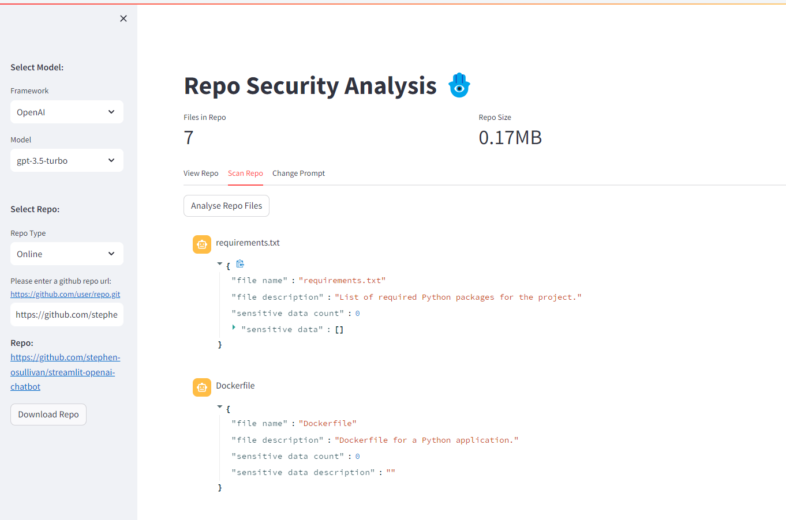

# Data Loss Prevention App

Streamlit langchain app to analyse a repo for DLP.

1) We download a repo using the gitpython package.
2) We then analyse the code in this repo using an LLM that can be selected from a variety of frameworks e.g. openai, hugginface, ollama.
3) We then output the results in a streamlit app.

If endpoint uses an openai compatible server you can set the default url using the environment variable: **DEFAULT_ENDPOINT_URL**

By default this uses 'http://localhost:11434/v1', which is the default ollama endpoint url.

Dockerfile is included for easy build and deployment.

